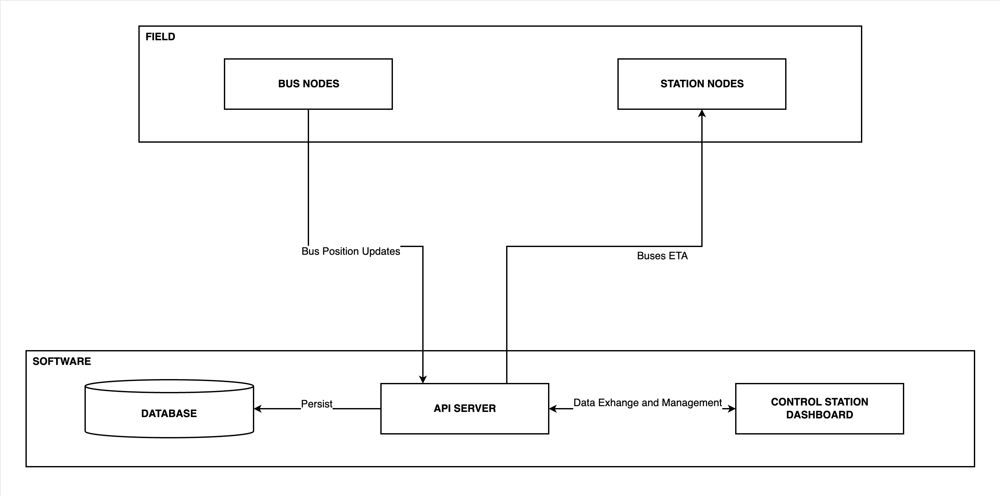
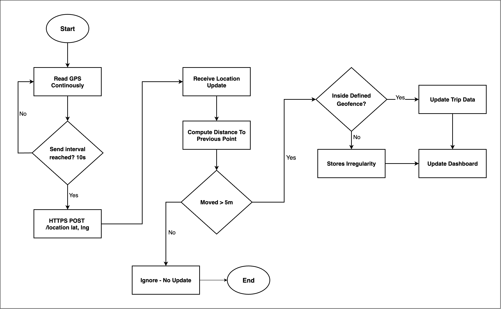
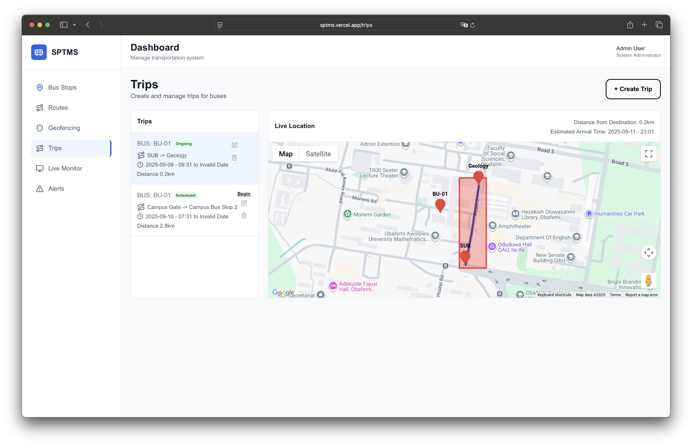

# SPTMS (Smart Public Transport Management System)

## 📌 Overview

<!-- SPTMS (Smart Public Transport Management System) is a project aimed at improving public transportation systems. It combines backend services, frontend interfaces, and hardware devices to manage routes, geofencing, notifications, and live monitoring. -->

**SPTMS (Smart Public Transport Management System)** is a full-stack project designed to improve the efficiency and reliability of public transportation.

It integrates **custom backend services**, **interactive web dashboards**, and **IoT hardware** into a unified solution for:

- 🚏 **Bus & Station Monitoring** – real-time tracking of vehicles and arrival times
- 📍 **Geofencing** – detection of route deviations and irregularities
- 🔔 **Notifications & Alerts** – for control room operators
- 📊 **Data Visualization** – dashboards for trip monitoring and system control

---

## ✨ Features

- **Custom Backend APIs** – built from scratch using Node.js & Express
- **Real-Time GPS Tracking** – continuous vehicle updates with distance validation
- **Route Geofencing** – alerts when buses leave predefined routes
- **Trip Monitoring Dashboard** – live status of buses and estimated time of arrival (ETA)
- **Bus Station Display** – 20×4 LCD at bus stops showing bus details and timings
- **Scalable Modular Design** – separation of backend, frontend, and hardware
<!-- - **Hardware Integration** – ESP32 bus nodes and station nodes connected via Wi-Fi   -->

---

## ⚙️ Tech Stack

- **Backend**: Node.js, TypeScript, Express.js
- **Frontend**: Next.js, React, TypeScript
- **Hardware**: C++, PlatformIO
- **Database**: Supabase Postgres
- **APIs**: Google Maps API

---

## ⚠️ Disclaimer  

Yeah, I know, using a monorepo for backend, frontend, and hardware together isn’t the most ideal structure for long-term scalability.  
But since I’m the only one working on this for now, I kept everything in a single repo to make life simple for myself 🌚.  

---

## 🗂️ Repository Structure

### 1. Backend (`/sptms-backend`)

Custom-built REST APIs for route management, geofencing, trip monitoring, and notifications.

<!-- **Commands:**
```bash
npm install        # Install dependencies
npm run dev          # Run the server
``` -->
<!-- npm run lint       # Lint the code
npm test           # Run tests   -->

<!-- --- -->

### 2. Frontend (`/sptms-frontend`)

Interactive web dashboard for live monitoring and system control.

<!-- **Commands:**
```bash
npm install        # Install dependencies
npm run dev        # Start development server
``` -->
<!-- npm run build      # Build for production
npm run lint       # Lint the code   -->

<!-- --- -->

### 3. Hardware

- **`/sptms-hardware`** → Bus node firmware (ESP32 + GPS)
- **`/sptms-hardware-bus-stop`** → Station node firmware (LCD 20×4 displays)

<!-- **Commands:**
```bash
pip install platformio       # Install PlatformIO
platformio run               # Build firmware
platformio run --target upload  # Upload firmware
``` -->

---

## Visuals

### System Architecture

#### Block Diagram

The block diagram below provides an overview of the system's architecture, showing the interaction between field devices (bus nodes and station nodes) and software components (API server, database, and control station dashboard). It demonstrates how bus position updates and ETA calculations are managed and persisted.



#### Flow Chart

The flow chart below illustrates the process of GPS data collection, geofence validation, and dashboard updates. It highlights how the system continuously reads GPS data, computes distances, and updates trip data or irregularities based on geofence checks.



### Hardware Devices - (3D design in work)

#### Bus Node


#### Bus Station Node


### Deployed Web Application



---

<!-- ## Integration Points

- **Backend-Frontend**: Communicate via REST APIs defined in `sptms-backend/src/routes/`.
- **Frontend-Hardware**: Interacts indirectly through backend APIs. -->

## External Dependencies

- **Google Maps API**

---

<!-- ## Getting Started

### Prerequisites

- Node.js and npm for backend and frontend development.
- PlatformIO for hardware development.

### Steps

1. Clone the repository:
   ```bash
   git clone https://github.com/usmahm/prms.git
   cd prms
   ```
2. Follow the setup instructions for each component (backend, frontend, hardware).

---

## Contributing

Contributions are welcome! Please follow the guidelines in `.github/CONTRIBUTING.md` (if available).

---

## License

This project is licensed under the MIT License. See `LICENSE` for details. -->
